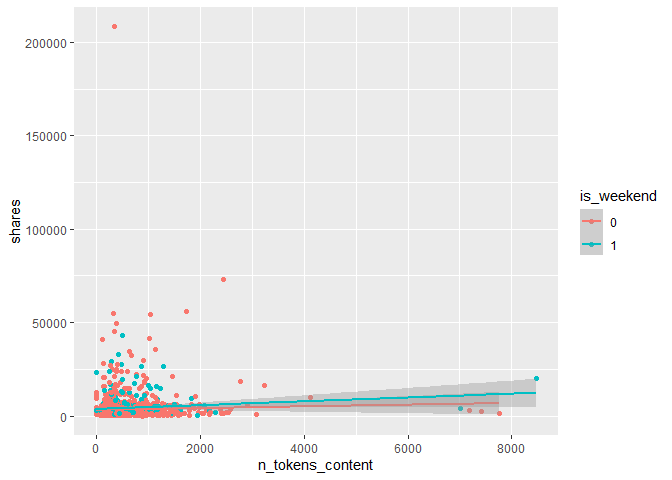

ST 558 Project 2
================
Kaylee Frazier and Rebecca Voelker
10/31/2021

-   [Introduction](#introduction)
-   [Exploratory Data Analysis (EDA)](#exploratory-data-analysis-eda)
    -   [Create New Variables for EDA](#create-new-variables-for-eda)
    -   [Graphical summary of shares by Content Length and Weekday
        vs. Weekend](#graphical-summary-of-shares-by-content-length-and-weekday-vs-weekend)
    -   [Graphical and Numerical summary of shares by Weekday
        vs. Weekend](#graphical-and-numerical-summary-of-shares-by-weekday-vs-weekend)
    -   [Graphical and Numerical summary of shares by Title Polarity and
        Length](#graphical-and-numerical-summary-of-shares-by-title-polarity-and-length)
    -   [Numerical summary of shares by
        day\_of\_the\_week](#numerical-summary-of-shares-by-day_of_the_week)
    -   [Bar chart of shares by day of the
        week](#bar-chart-of-shares-by-day-of-the-week)
    -   [Summary table of shares by number of
        images](#summary-table-of-shares-by-number-of-images)
    -   [Scatter plot of the image number and
        shares.](#scatter-plot-of-the-image-number-and-shares)
    -   [Scatter plot of the number of videos and
        shares.](#scatter-plot-of-the-number-of-videos-and-shares)
-   [Modeling](#modeling)
    -   [Linear Regression Models](#linear-regression-models)
    -   [Random Forest Model](#random-forest-model)
-   [Model Comparison and Selection](#model-comparison-and-selection)

## Introduction

#### The following is an analysis of online news popularity across a variety of channels. This analysis covers the following 6 data channels:

1.  Lifestyle
2.  Entertainment
3.  Business
4.  Social Media
5.  Tech
6.  World

#### The following report analyzes the \# of shares of a particular piece of content as a function of a variety of variables, including;

-   Number of Images in the Content (num\_imgs)
-   Number of Videos in the Content (num\_videos)
-   Week vs. Weekend Publications (is\_weekend)
-   Number of Words in the Content (n\_tokens\_content)
-   Number of Words in the Title (n\_tokens\_titel)
-   Polarity of the Content Title (abs\_title\_sentiment\_polarity)

#### A few new variables were created, as well, which are described alongside the respective R Code.

#### As a part of our analysis, we modeled each of our predictive variables linearly, as well as via Random Forest and Boosted Tree Models. The various models were then compared against one another to select our final model, which was fit to our test data.

``` r
#Read in Libraries

library(tidyverse)
library(readr)
library(ggplot2)
library(randomForest)
library(shiny)
library(dplyr)
library(caret)
```

``` r
## Check Working Directory Path
getwd()
```

    ## [1] "C:/Users/Rebecca/OneDrive/Desktop/ST 558/Repos/Project2"

``` r
## Read in Raw Data Using Relative Path
rawData <- read_csv(file = "./project2_rawdata.csv") 
rawData
```

    ## # A tibble: 39,644 x 61
    ##    url        timedelta n_tokens_title n_tokens_content n_unique_tokens
    ##    <chr>          <dbl>          <dbl>            <dbl>           <dbl>
    ##  1 http://ma~       731             12              219           0.664
    ##  2 http://ma~       731              9              255           0.605
    ##  3 http://ma~       731              9              211           0.575
    ##  4 http://ma~       731              9              531           0.504
    ##  5 http://ma~       731             13             1072           0.416
    ##  6 http://ma~       731             10              370           0.560
    ##  7 http://ma~       731              8              960           0.418
    ##  8 http://ma~       731             12              989           0.434
    ##  9 http://ma~       731             11               97           0.670
    ## 10 http://ma~       731             10              231           0.636
    ## # ... with 39,634 more rows, and 56 more variables:
    ## #   n_non_stop_words <dbl>, n_non_stop_unique_tokens <dbl>,
    ## #   num_hrefs <dbl>, num_self_hrefs <dbl>, num_imgs <dbl>,
    ## #   num_videos <dbl>, average_token_length <dbl>, num_keywords <dbl>,
    ## #   data_channel_is_lifestyle <dbl>,
    ## #   data_channel_is_entertainment <dbl>, data_channel_is_bus <dbl>,
    ## #   data_channel_is_socmed <dbl>, data_channel_is_tech <dbl>, ...

``` r
## Create a New Variable to Data Channel
rawDataNew <- rawData %>% mutate(data_channel =   if_else(data_channel_is_bus == 1, "Business",
       if_else(data_channel_is_entertainment == 1, "Entertainment",
               if_else(data_channel_is_lifestyle == 1, "Lifestyle",
                      if_else(data_channel_is_socmed == 1, "Social Media",
                              if_else(data_channel_is_tech == 1, "Tech", "World"))))))

## Subset Data for Respective Data Channel
subsetData <- rawDataNew %>% filter(data_channel == params$data_channel)

## Create Training and Test Data Sets
set.seed(500)
trainIndex <- createDataPartition(subsetData$shares, p = 0.7, list = FALSE)

trainData <- subsetData[trainIndex,]
testData <- subsetData[-trainIndex,]

trainData
```

    ## # A tibble: 1,472 x 62
    ##    url        timedelta n_tokens_title n_tokens_content n_unique_tokens
    ##    <chr>          <dbl>          <dbl>            <dbl>           <dbl>
    ##  1 http://ma~       731             11              103           0.689
    ##  2 http://ma~       731             10              243           0.619
    ##  3 http://ma~       731              8              204           0.586
    ##  4 http://ma~       730             12              499           0.513
    ##  5 http://ma~       729             11              223           0.662
    ##  6 http://ma~       729             11             1099           0.412
    ##  7 http://ma~       729             14              318           0.633
    ##  8 http://ma~       729              7              144           0.723
    ##  9 http://ma~       729             11             1058           0.410
    ## 10 http://ma~       729              8              211           0.608
    ## # ... with 1,462 more rows, and 57 more variables:
    ## #   n_non_stop_words <dbl>, n_non_stop_unique_tokens <dbl>,
    ## #   num_hrefs <dbl>, num_self_hrefs <dbl>, num_imgs <dbl>,
    ## #   num_videos <dbl>, average_token_length <dbl>, num_keywords <dbl>,
    ## #   data_channel_is_lifestyle <dbl>,
    ## #   data_channel_is_entertainment <dbl>, data_channel_is_bus <dbl>,
    ## #   data_channel_is_socmed <dbl>, data_channel_is_tech <dbl>, ...

``` r
testData
```

    ## # A tibble: 627 x 62
    ##    url        timedelta n_tokens_title n_tokens_content n_unique_tokens
    ##    <chr>          <dbl>          <dbl>            <dbl>           <dbl>
    ##  1 http://ma~       731              8              960           0.418
    ##  2 http://ma~       731             10              187           0.667
    ##  3 http://ma~       731             11              315           0.551
    ##  4 http://ma~       731             10             1190           0.409
    ##  5 http://ma~       731              6              374           0.641
    ##  6 http://ma~       729              7             1007           0.438
    ##  7 http://ma~       729              9              455           0.496
    ##  8 http://ma~       729             10              258           0.589
    ##  9 http://ma~       729              8             1020           0.413
    ## 10 http://ma~       729              8              123           0.717
    ## # ... with 617 more rows, and 57 more variables:
    ## #   n_non_stop_words <dbl>, n_non_stop_unique_tokens <dbl>,
    ## #   num_hrefs <dbl>, num_self_hrefs <dbl>, num_imgs <dbl>,
    ## #   num_videos <dbl>, average_token_length <dbl>, num_keywords <dbl>,
    ## #   data_channel_is_lifestyle <dbl>,
    ## #   data_channel_is_entertainment <dbl>, data_channel_is_bus <dbl>,
    ## #   data_channel_is_socmed <dbl>, data_channel_is_tech <dbl>, ...

=======

## Exploratory Data Analysis (EDA)

### Create New Variables for EDA

``` r
#Create New Variable that Measures Title Length
trainData <- trainData %>% mutate(TitleLength = if_else(n_tokens_title <= 10, "Short Title",
  if_else(n_tokens_title <= 15, "Medium Title", "Long Title")))

#Create New variable using weekday_is_() variables
trainDataNew <- trainData %>% mutate(day_of_the_week =   if_else(weekday_is_monday == 1, "Monday",
       if_else(weekday_is_tuesday == 1, "Tuesday",
               if_else(weekday_is_wednesday == 1, "Wednesday",
                      if_else(weekday_is_thursday == 1, "Thursday",
                              if_else(weekday_is_friday == 1, "Friday",
                                      if_else(weekday_is_saturday == 1, "Saturday", "Sunday"
                                              ))))))) 
trainDataNew
```

    ## # A tibble: 1,472 x 64
    ##    url        timedelta n_tokens_title n_tokens_content n_unique_tokens
    ##    <chr>          <dbl>          <dbl>            <dbl>           <dbl>
    ##  1 http://ma~       731             11              103           0.689
    ##  2 http://ma~       731             10              243           0.619
    ##  3 http://ma~       731              8              204           0.586
    ##  4 http://ma~       730             12              499           0.513
    ##  5 http://ma~       729             11              223           0.662
    ##  6 http://ma~       729             11             1099           0.412
    ##  7 http://ma~       729             14              318           0.633
    ##  8 http://ma~       729              7              144           0.723
    ##  9 http://ma~       729             11             1058           0.410
    ## 10 http://ma~       729              8              211           0.608
    ## # ... with 1,462 more rows, and 59 more variables:
    ## #   n_non_stop_words <dbl>, n_non_stop_unique_tokens <dbl>,
    ## #   num_hrefs <dbl>, num_self_hrefs <dbl>, num_imgs <dbl>,
    ## #   num_videos <dbl>, average_token_length <dbl>, num_keywords <dbl>,
    ## #   data_channel_is_lifestyle <dbl>,
    ## #   data_channel_is_entertainment <dbl>, data_channel_is_bus <dbl>,
    ## #   data_channel_is_socmed <dbl>, data_channel_is_tech <dbl>, ...

### Graphical summary of shares by Content Length and Weekday vs. Weekend

``` r
#Convert is_weekend to a Factor
trainData$is_weekend <- factor(trainData$is_weekend)

#Table of Publications on Weekdays vs. Weekend 
table(trainData$is_weekend)
```

    ## 
    ##    0    1 
    ## 1209  263

``` r
#Create a Scatter Plot of # of Words by Shares
g1 <- ggplot(trainData, aes(x = n_tokens_content, y = shares)) + 
  geom_point(aes(col = is_weekend)) + 
    geom_smooth(method = "lm", aes(col = is_weekend)) 
g1
```

<!-- -->

#### We can inspect the trend of shares as a function of the number of words (tokens) in the content. If the points show an upward trend, then content with more words tends to be shared more often.If we see a negative trend then content with more words tends to be shared less often. The color-coding specifies if the content was published on a Weekday or Weekend.

### Graphical and Numerical summary of shares by Weekday vs. Weekend

``` r
#Create a Box Plot of Weekend vs. Weekday by Shares
g2 <- ggplot(trainData, aes(x = is_weekend, y = shares)) +
  geom_boxplot()
g2
```

<!-- -->

``` r
#Generate a Numerical Summary of Data Summarized in our Box Plot 
trainData %>% group_by(is_weekend) %>% summarise(min = min(shares), med = median(shares), max = max(shares), mean = mean(shares))
```

    ## # A tibble: 2 x 5
    ##   is_weekend   min   med    max  mean
    ##   <fct>      <dbl> <dbl>  <dbl> <dbl>
    ## 1 0             78  1600 208300 3459.
    ## 2 1            446  2200  43000 4334.

#### We can inspect the trend of shares as a function of Weekday vs. Weekend Publications. The statistics show the Minimum, Maximum, Median, and Average \# of Shares by Week (Published During the Week) vs. Weekend (Published During the Weekend)

### Graphical and Numerical summary of shares by Title Polarity and Length

``` r
table(trainData$n_tokens_title)
```

    ## 
    ##   3   5   6   7   8   9  10  11  12  13  14  15  16  17  18 
    ##   1   6  33 109 234 302 281 238 135  85  33  10   2   2   1

``` r
# Create a Scatter Plot of Polarity of Title by Shares
g3 <- ggplot(trainData, aes(x = abs_title_sentiment_polarity, y = shares)) + 
  geom_point(aes(col = TitleLength)) + 
    geom_smooth(method = "lm", aes(col = TitleLength)) 
g3
```

    ## `geom_smooth()` using formula 'y ~ x'

<!-- -->

``` r
# Numerical Correlation of Polarity of Title by Shares
cor(trainData$abs_title_sentiment_polarity, trainData$shares)
```

    ## [1] 0.0150003

#### We can inspect the trend of shares as a function of the polarity of the title of the content. If the points show an upward trend, then content with a more polarizing title (positive or negative) tends to be shared more often.If we see a negative trend then content with more a more polarizing title (positive or negative) tends to be shared less often. The color-coding specifies the length of the title. The correlation, shows us the numerical value of the correlation between our predictor variable(s) and response

### Numerical summary of shares by day\_of\_the\_week

``` r
#find mean, median, and standard deviation of shares by day_of_the_week
daySummary <-trainDataNew %>% group_by(day_of_the_week) %>% summarise(avg_shares = mean(shares), med_shares = median(shares), sd_shares = sd(shares))

#print out numerical summary
daySummary
```

    ## # A tibble: 7 x 4
    ##   day_of_the_week avg_shares med_shares sd_shares
    ##   <chr>                <dbl>      <dbl>     <dbl>
    ## 1 Friday               2832.       1400     3848.
    ## 2 Monday               3491.       1600     5433.
    ## 3 Saturday             4476.       2500     5978.
    ## 4 Sunday               4202.       2050     5651.
    ## 5 Thursday             3292.       1500     5924.
    ## 6 Tuesday              4105.       1500    14793.
    ## 7 Wednesday            3500.       1700     6294.

#### In the summary plot you can see which days had the highest and lowest average shares, median shares, and look at the standard deviation to see which day had the largest range of shares.

### Bar chart of shares by day of the week

``` r
#create a basic plot with x and y variables
g5 <- ggplot(data = trainDataNew, aes(day_of_the_week, shares))
#make the plot a bar chart
g5 + geom_col(aes(fill = day_of_the_week), position = "dodge") + 
#change the angle of the words to fit 
  guides(x = guide_axis(angle = 45)) +
  labs(title = "Day of the Week vs. Shares") +
#get rid of legend
  theme(legend.position = "none")
```

<!-- -->

#### In this bar chart of day of the week vs. shares, you can see which days had the greatest total number of shares and which had the lowest.

### Summary table of shares by number of images

``` r
#create summary table with different ranges of images
imagesSummary <- trainData %>% group_by(cut(num_imgs, c(min(num_imgs), 10, 20, 40, 60, 80, max(num_imgs)))) %>% summarise(avg_shares = mean(shares), med_shares = median(shares), sd_shares = sd(shares))

#rename column name
names(imagesSummary)[names(imagesSummary) == "cut(num_imgs, c(min(num_imgs), 10, 20, 40, 60, 80, max(num_imgs)))"] <- "image_number"

#print out numerical summary
imagesSummary
```

    ## # A tibble: 6 x 4
    ##   image_number avg_shares med_shares sd_shares
    ##   <fct>             <dbl>      <dbl>     <dbl>
    ## 1 (0,10]            3182.       1600     5843.
    ## 2 (10,20]           5107.       1900    15117.
    ## 3 (20,40]           7849.       5000     8180.
    ## 4 (40,60]           3860        2700     3012.
    ## 5 (80,111]          7450        3550     8665.
    ## 6 <NA>              3216.       1600     4786.

#### In the summary plot you can see if the amount of images affected the average, median, and standard deviation of shares.

### Scatter plot of the image number and shares.

``` r
#create basic plot with x and y
g6 <- ggplot(trainData, aes(x = num_imgs, y = shares))  
#make it a scatter plot with regression line
g6 + geom_point() + 
    geom_smooth(method = "lm")
```

    ## `geom_smooth()` using formula 'y ~ x'

<!-- -->

#### In this scatter plot of the number of images vs. shares, you can see the relationship between the two variables. If it shows an upward trend, articles with more images tend to be shared more often. If the trend is negative, then articles with less images tend to be shared more.

### Scatter plot of the number of videos and shares.

``` r
#create basic plot with x and y
g7 <- ggplot(trainData, aes(x = num_videos, y = shares))  
#make it a scatter plot with regression line
g7 + geom_point() + 
    geom_smooth(method = "lm")
```

    ## `geom_smooth()` using formula 'y ~ x'

<!-- -->

#### In this scatter plot of the number of videos vs. shares, you can see the relationship between the two variables. If it shows an upward trend, articles with more videos tend to be shared more often. If the trend is negative, then articles with less videos tend to be shared more.

## Modeling

### Linear Regression Models

#### A linear regression model allows for easy prediction of a response variable. It’s goal is to figure out which variables are significant predictors of the response variable and how do they impact it.

#### This Multiple Linear Regression Model looks at the \# of Shares as a function of the \# of Words in the Content AND whether or not the Content was published on a Weekend (0 = No, 1 = Yes)

``` r
## Convert is_weekend to Numeric
trainData$is_weekend <- as.numeric(trainData$is_weekend)

## Fit Multiple Linear Regression Model
fitLM1 <- train(shares ~ n_tokens_content + is_weekend, data = trainData, method = "lm", trControl = trainControl(method = "cv", number = 10))
fitLM1 
```

    ## Linear Regression 
    ## 
    ## 1472 samples
    ##    2 predictor
    ## 
    ## No pre-processing
    ## Resampling: Cross-Validated (10 fold) 
    ## Summary of sample sizes: 1324, 1325, 1324, 1324, 1326, 1325, ... 
    ## Resampling results:
    ## 
    ##   RMSE      Rsquared    MAE     
    ##   6813.136  0.01233896  3205.776
    ## 
    ## Tuning parameter 'intercept' was held constant at a value of TRUE

#### This Multiple Linear Regression Model looks at the \# of Shares as a function of the \# the Quadratic of Title Polarity Sentiment AND the Title Length (Short, Medium, Long)

``` r
## Fit Multiple Linear Regression Model
fitLM2 <- train(shares ~ abs_title_sentiment_polarity^2 + TitleLength, data = trainData, method = "lm", trControl = trainControl(method = "cv", number = 10))
fitLM2
```

    ## Linear Regression 
    ## 
    ## 1472 samples
    ##    2 predictor
    ## 
    ## No pre-processing
    ## Resampling: Cross-Validated (10 fold) 
    ## Summary of sample sizes: 1324, 1324, 1326, 1324, 1324, 1324, ... 
    ## Resampling results:
    ## 
    ##   RMSE      Rsquared     MAE     
    ##   6769.895  0.001807643  3223.631
    ## 
    ## Tuning parameter 'intercept' was held constant at a value of TRUE

#### This multiple linear regression model looks at day of the week, number of images, and number of videos as predictors and shares as response.

``` r
#create fit using shares as response, day_of_the_week, num_imgs, and num_videos as the predictors
fitLM3 <- train(shares ~ day_of_the_week + num_imgs + num_videos, data = trainDataNew, 
#method is linear model
              method = "lm", 
#center and scale the data
                preProcess = c("center", "scale"),
#10 fold cross validation
              trControl = trainControl(method = "cv", number = 10))
fitLM3
```

    ## Linear Regression 
    ## 
    ## 1472 samples
    ##    3 predictor
    ## 
    ## Pre-processing: centered (8), scaled (8) 
    ## Resampling: Cross-Validated (10 fold) 
    ## Summary of sample sizes: 1325, 1324, 1324, 1327, 1324, 1324, ... 
    ## Resampling results:
    ## 
    ##   RMSE      Rsquared    MAE    
    ##   6919.246  0.01589612  3195.59
    ## 
    ## Tuning parameter 'intercept' was held constant at a value of TRUE

### Random Forest Model

#### Random forest modeling is a type of ensemble model that creates multiple trees from bootstrap samples without using all the predictors and a random subset of predictors for each sample. It then averages the results from the multiple trees.

``` r
#use train function
rfFit <- train(shares ~ day_of_the_week + num_imgs + num_videos + n_tokens_content, data = trainDataNew,
#use rf method
               method = "rf",
#5 fold validation
               trControl = trainControl(method = "cv", number = 5),
#consider values of mtry 
               tuneGrid = data.frame(mtry = 1:4))
rfFit
```

    ## Random Forest 
    ## 
    ## 1472 samples
    ##    4 predictor
    ## 
    ## No pre-processing
    ## Resampling: Cross-Validated (5 fold) 
    ## Summary of sample sizes: 1178, 1177, 1177, 1179, 1177 
    ## Resampling results across tuning parameters:
    ## 
    ##   mtry  RMSE      Rsquared     MAE     
    ##   1     7218.148  0.009131572  3166.787
    ##   2     7307.646  0.010092597  3198.263
    ##   3     7445.881  0.008780014  3272.651
    ##   4     7532.481  0.007005918  3328.569
    ## 
    ## RMSE was used to select the optimal model using the smallest value.
    ## The final value used for the model was mtry = 1.

#### Boosted Tree Model

#### Boosted modeling is a type of ensemble model that grows subsequent trees off of modified version of the original data. Any resulting predictions are updated as your Boosted Tree Model grows, based on criteria like the \# of Subsequent Trees, Shrinkage Paramter, etc.

``` r
n.trees <- c(5, 10, 25, 100)
interaction.depth <- 1:4
shrinkage <- 0.1
n.minobsinnode <- 10

df <- expand.grid(n.trees = n.trees, interaction.depth = interaction.depth, shrinkage = shrinkage, n.minobsinnode = n.minobsinnode)

boostFit <- train(shares ~ abs_title_sentiment_polarity^2 + TitleLength, data = trainData, method = "gbm", trControl = trainControl(method = "cv", number = 5), tuneGrid = df)

boostFit$results
boostFit$bestTune
```

## Model Comparison and Selection

``` r
#Add New Variables (Title Length and Day of the Week) to Test Data
testData <- testData %>% mutate(TitleLength = if_else(n_tokens_title <= 10, "Short Title",
  if_else(n_tokens_title <= 15, "Medium Title", "Long Title")))

testData <- testData %>% mutate(day_of_the_week =   if_else(weekday_is_monday == 1, "Monday",
       if_else(weekday_is_tuesday == 1, "Tuesday",
               if_else(weekday_is_wednesday == 1, "Wednesday",
                      if_else(weekday_is_thursday == 1, "Thursday",
                              if_else(weekday_is_friday == 1, "Friday",
                                      if_else(weekday_is_saturday == 1, "Saturday", "Sunday"
                                              ))))))) 

## Obtain RMSE on Test Data for Linear Models
predLM1 <- predict(fitLM1, newdata = testData)
postResample(predLM1, obs = testData$shares)
```

    ##         RMSE     Rsquared          MAE 
    ## 1.093444e+04 3.667553e-03 3.040098e+03

``` r
predLM2 <- predict(fitLM2, newdata = testData)
postResample(predLM2, obs = testData$shares)
```

    ##         RMSE     Rsquared          MAE 
    ## 1.090790e+04 1.551825e-07 3.453763e+03

``` r
predLM3 <- predict(fitLM3, newdata = testData)
postResample(predLM3, obs = testData$shares)
```

    ##         RMSE     Rsquared          MAE 
    ## 1.091059e+04 8.855373e-04 3.445044e+03

``` r
## Obtain RMSE on Test Data for Random Forest Model
predRF <- predict(rfFit, newdata = testData)
postResample(predRF, testData$shares)
```

    ##         RMSE     Rsquared          MAE 
    ## 1.088505e+04 3.889002e-03 3.434888e+03

``` r
## Obtain RMSE on Test Data for Boosted Fit Model
predBoost <- predict(boostFit, newdata = testData)
postResample(predBoost, testData$shares)
```

    ##         RMSE     Rsquared          MAE 
    ## 1.091122e+04 5.604592e-04 3.418778e+03

#### The model with the lowest RMSE should be used to predict shares as a function of the listed predictor variables, for that particular data channel.
